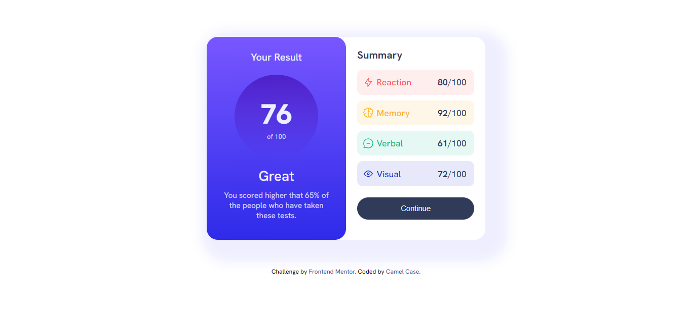

# Frontend Mentor - Results summary component solution

This is a solution to the [Results summary component challenge on Frontend Mentor](https://www.frontendmentor.io/challenges/results-summary-component-CE_K6s0maV). Frontend Mentor challenges help you improve your coding skills by building realistic projects. 

## Table of contents

- [Overview](#overview)
  - [The challenge](#the-challenge)
  - [Screenshot](#screenshot)
  - [Links](#links)
- [My process](#my-process)
  - [Built with](#built-with)
  - [What I learned](#what-i-learned)
  - [Continued development](#continued-development)
  - [Useful resources](#useful-resources)
- [Author](#author)
- [Acknowledgments](#acknowledgments)

**Note: Delete this note and update the table of contents based on what sections you keep.**

## Overview

### The challenge

Users should be able to:

- View the optimal layout for the interface depending on their device's screen size
- See hover and focus states for all interactive elements on the page

### Screenshot



### Links

- Solution URL: [Solution URL](https://github.com/camelCase-cc/frontend-mentor-result-summary-component)
- Live Site URL: [live site URL](https://camelcase-cc.github.io/frontend-mentor-result-summary-component/)

## My process

### Built with

- Semantic HTML5 markup
- CSS custom properties
- Flexbox
- css variables
- Mobile-first workflow

### What I learned

I acquired several valuable skills and knowledge that have enhanced my frontend development capabilities. Here are some of the key learnings:

Flexbox: I gained a thorough understanding of how to utilize the flexbox layout module to create flexible and responsive designs. This enabled me to easily align and distribute elements within containers.

Media Queries: By mastering media queries, I learned how to adapt my designs to different screen sizes and devices.

Mobile-First Approach: I adopted a mobile-first approach, prioritizing the design and development for mobile devices.

Box Shadow: I learned how to apply box shadows effectively, adding depth and dimension to elements in my designs. 

Gradient Backgrounds: I explored the usage of gradient backgrounds to add visual interest and create captivating designs.

These newfound skills and knowledge have significantly improved my frontend development expertise, empowering me to build modern and responsive websites or applications. I'm excited to continue applying these learnings to future projects, further refining my abilities as a frontend developer.

To see how you can add code snippets, see below:

```html
<h1>Some HTML code I'm proud of</h1>
```
```css
:root {
    --primary-light-red: hsl(0, 100%, 67%);
    --primary-Orangey-yellow: hsl(39, 100%, 56%);
    --primary-Green-teal: hsl(166, 100%, 37%);
    --primary-Cobalt-blue: hsl(234, 85%, 45%);

    --primary-light-red-bg: hsla(0, 100%, 67%, 0.1);
    --primary-Orangey-yellow-bg: hsla(39, 100%, 56%, 0.1);
    --primary-Green-teal-bg: hsla(166, 100%, 37%, 0.1);
    --primary-Cobalt-blue-bg: hsla(234, 85%, 45%, 0.1);

    --gradient-light-slate-blue-bg: hsl(252, 100%, 67%);
    --gradient-light-royal-blue-bg: hsl(241, 81%, 54%);
    --gradient-violet-blue-circle: hsla(256, 72%, 46%, 1);
    --gradient-Persian-blue-circle: hsla(241, 72%, 46%, 0);

    --neutral-White: hsl(0, 0%, 100%);
    --neutral-Pale-blue: hsl(221, 100%, 96%);
    --neutral-light-lavender: hsl(241, 100%, 89%);
    --neutral-dark-gray-blue: hsl(224, 30%, 27%);

    --font-size-paragraphs: 18px;
    --font-family: 'Hanken Grotesk', sans-serif;
    --font-weight-light: 500;
    --font-weight-semi: 700;
    --font-weight-bold: 800;
}
```

### Continued development

I am eager to continue incorporating media queries in my future projects, as they form the backbone of responsive web design and ensure the best possible experience for users across various devices.

## Author
- Frontend Mentor - [@Jeremiah-mp](https://www.frontendmentor.io/profile/Jeremiah-mp)
- Twitter - [@camelC_ase](https://twitter.com/camelC_ase)
